

# Bubble Player

**A friendlier video player for Firefox for Android.** 
A small bubble appears on a playing video. Tap it for a clean fullscreen player with gestures.

[**Get it on addons.mozilla.org**](https://addons.mozilla.org/firefox/addon/bubble-player/) ·
[Report a problem](https://github.com/andpii/bubble-player/issues/new?template=bug.yml) ·
[Suggest a feature](https://github.com/andpii/bubble-player/issues/new?template=feature.yml)

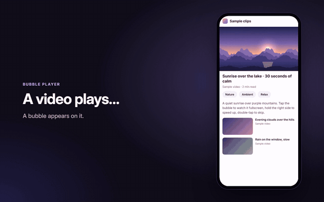

[Watch the demo as video (MP4)](media/demo.mp4)

Inspired by the Video Assistant in Samsung Internet: if you moved to Firefox and miss it, this brings the same
idea over, with more gestures and settings.

## What it does

When a video plays, a small glass bubble appears. Tap it and the video opens fullscreen in a clean player. Close
it and the video goes back to the page, right where it was.

**Gestures**

- **Hold to speed up:** long-press the right side to play at 2× until you let go. It glides back to normal speed
  without the usual audio hiccup.
- **Double-tap to skip:** the left or right side jumps back or ahead 10 seconds. Keep tapping to skip more; the
  video jumps once when you stop.
- **Double-tap the middle** to play or pause.
- **Swipe to seek:** small swipes are precise, long swipes go far, pull down to cancel. A preview shows the
  picture at that spot.
- **Swipe up or down** on the right for volume, on the left to dim the picture.
- Swipes from the very edges are left to Android (notifications, back gesture).

Hold-for-2× also works on videos right in the page, without opening the player.

**Player:** auto-rotate to fit the video, a rotate button, an optional screen lock, playback speed menu
(0.5×–3×), fit or fill, and loop. Muted feed videos get their sound back when you open them.

**Make it yours:** any accent color, the hold speed and side, the skip time, which buttons and gestures you want,
and sites where it stays off.

**Privacy:** collects nothing and sends nothing anywhere. No ads, no account, no tracking.

## Screenshots

<table>
  <tr>
    <td>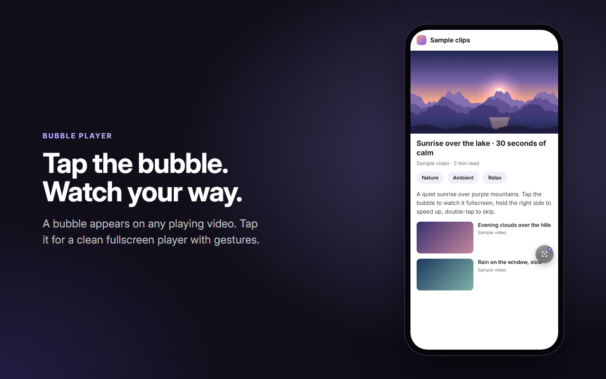</td>
    <td>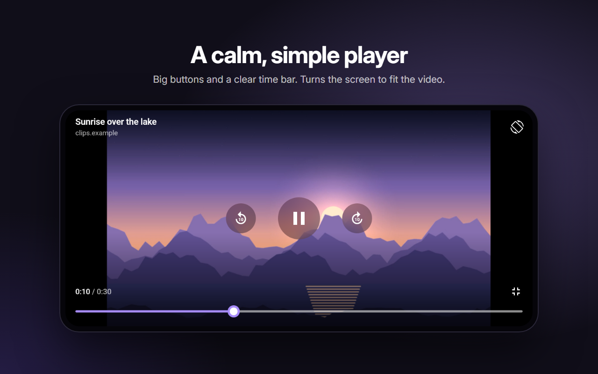</td>
  </tr>
  <tr>
    <td align="center">Tap the bubble on any playing video</td>
    <td align="center">A calm, simple fullscreen player</td>
  </tr>
  <tr>
    <td>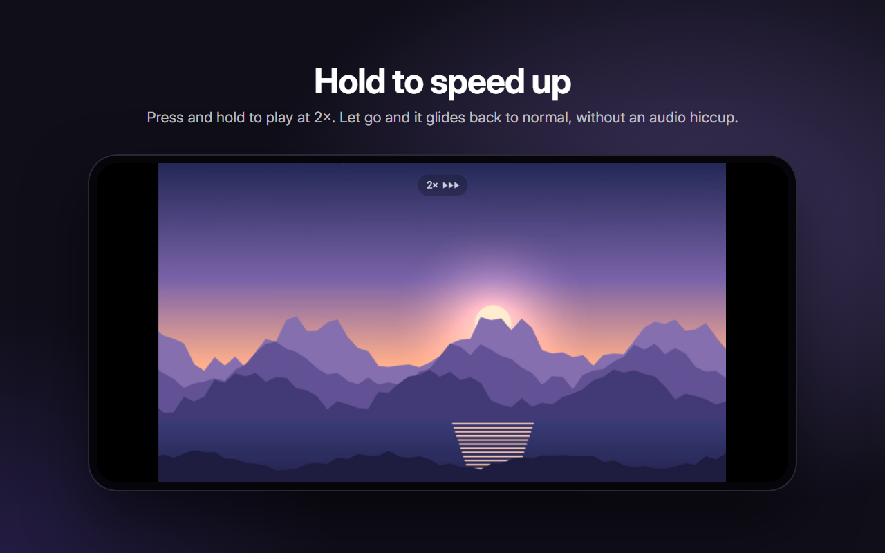</td>
    <td>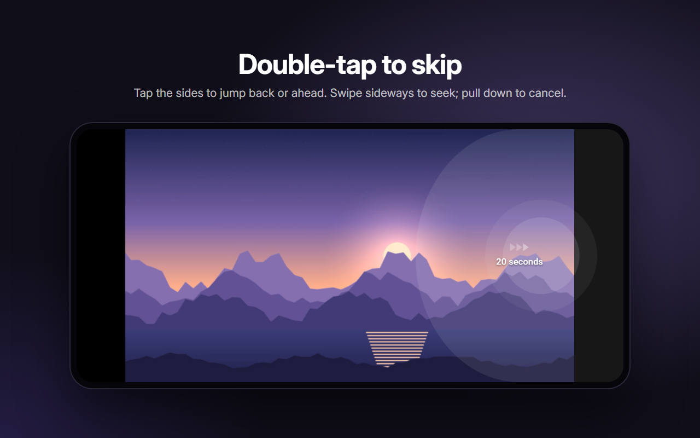</td>
  </tr>
  <tr>
    <td align="center">Hold to play at 2×</td>
    <td align="center">Double-tap to skip, swipe to seek</td>
  </tr>
  <tr>
    <td>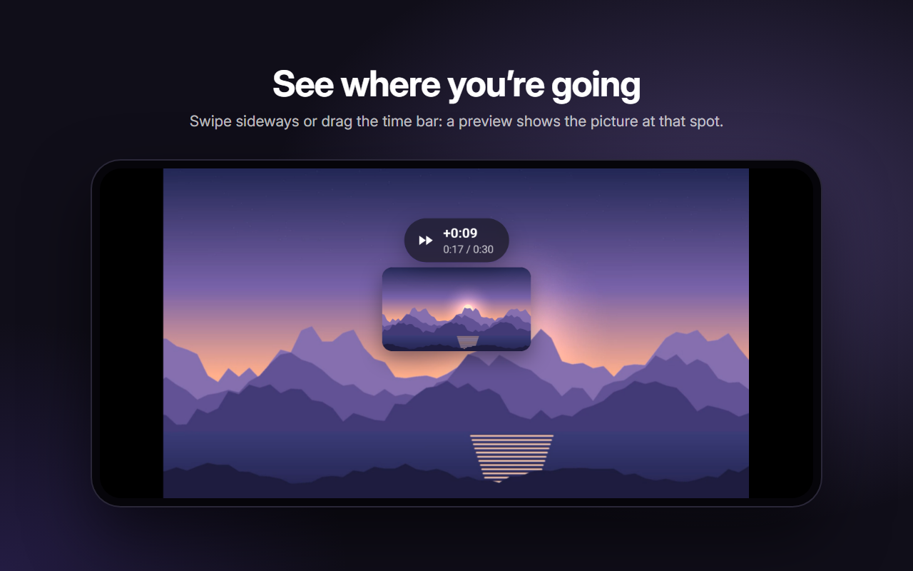</td>
    <td>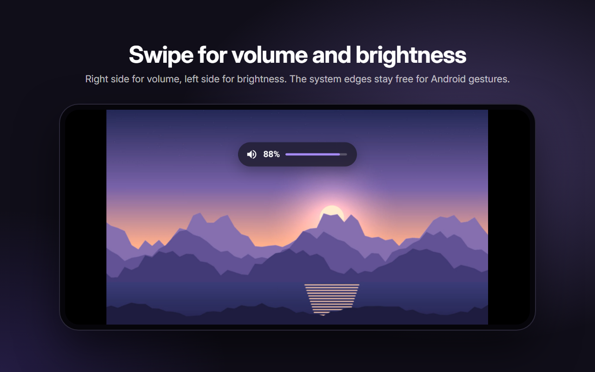</td>
  </tr>
  <tr>
    <td align="center">See where you're going: a preview while you seek</td>
    <td align="center">Swipe for volume and brightness</td>
  </tr>
  <tr>
    <td>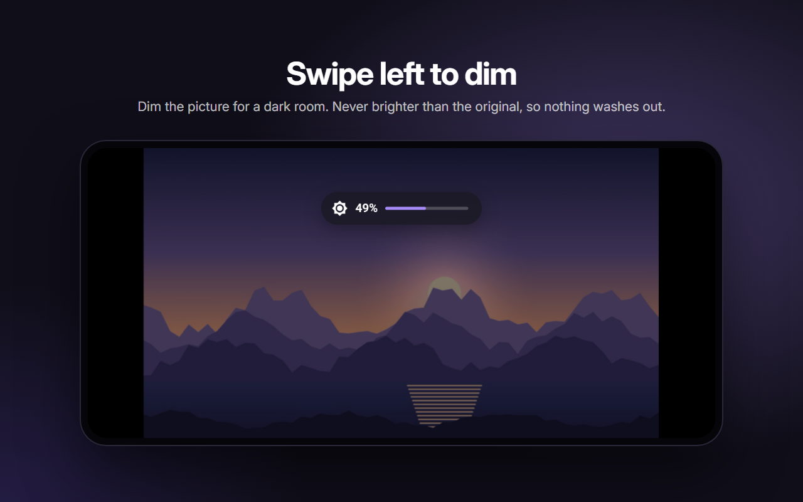</td>
    <td>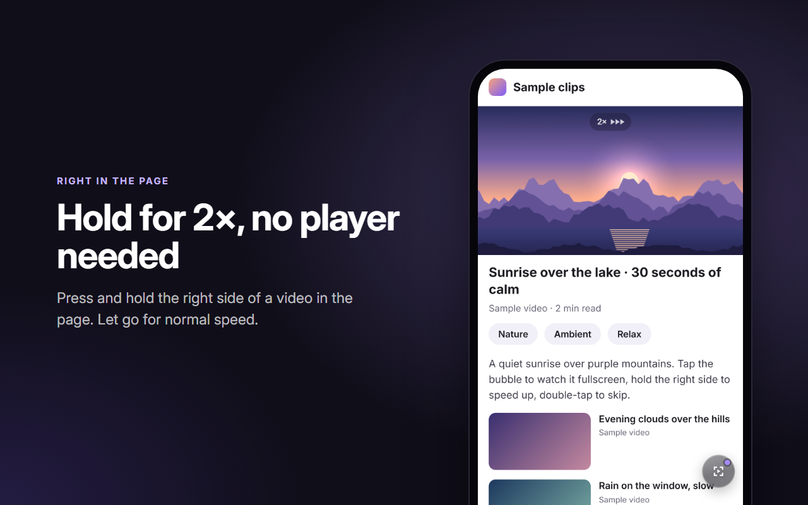</td>
  </tr>
  <tr>
    <td align="center">Swipe left to dim the picture</td>
    <td align="center">Hold for 2× right in the page, no player needed</td>
  </tr>
  <tr>
    <td>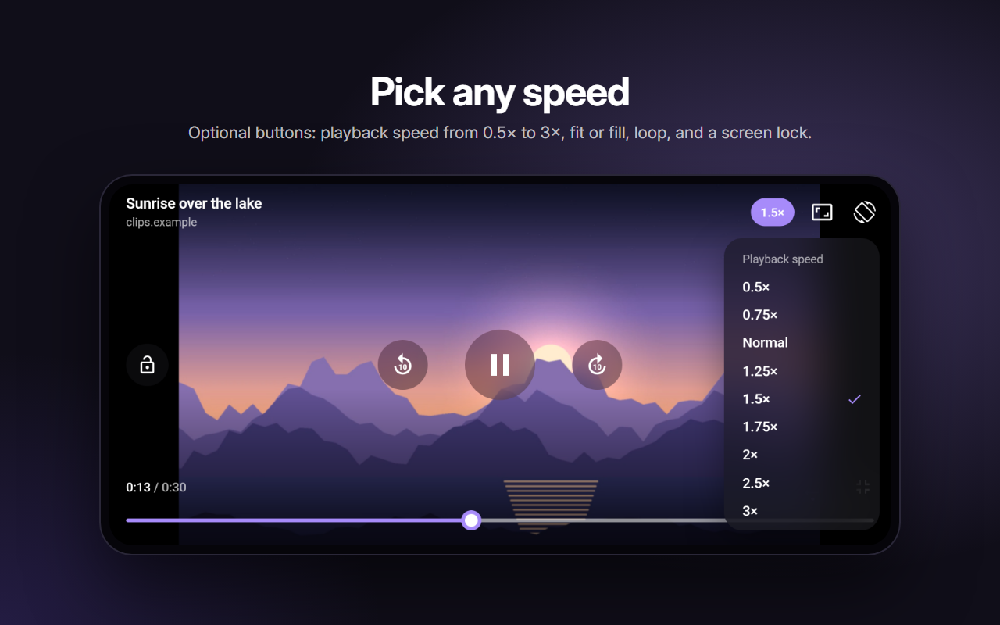</td>
    <td>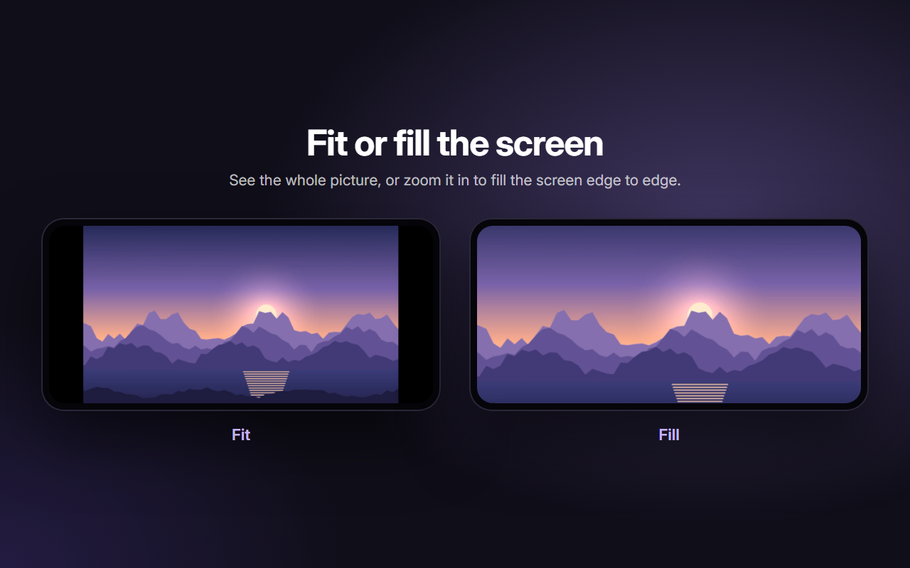</td>
  </tr>
  <tr>
    <td align="center">Pick any speed (optional speed, fit, loop and lock buttons)</td>
    <td align="center">Fit the whole picture, or fill the screen</td>
  </tr>
  <tr>
    <td>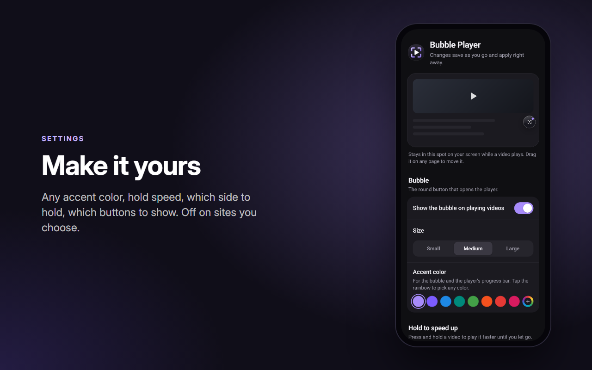</td>
    <td>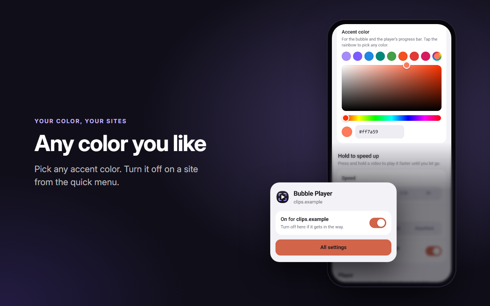</td>
  </tr>
  <tr>
    <td align="center">Any accent color, your buttons, your gestures</td>
    <td align="center">Any color you like; turn it off on a site from the quick menu</td>
  </tr>
</table>

## Report a problem or suggest something

This repository is for bug reports and ideas; the add-on's code isn't published here.

- [**Report a problem**](https://github.com/andpii/bubble-player/issues/new?template=bug.yml). Quickest from the
  add-on itself: Bubble Player settings → _Report a problem_ fills in the versions for you.
- [**Suggest a feature**](https://github.com/andpii/bubble-player/issues/new?template=feature.yml)
- Have a quick look at the [open issues](https://github.com/andpii/bubble-player/issues) first: someone may have
  reported it already, and a 👍 or a comment with your site helps too.

Screenshots or a short screen recording help a lot with gesture problems.

## Support

Bubble Player is free, with no ads or tracking. If you enjoy it, you can
[buy me a coffee on Ko-fi](https://ko-fi.com/andpii) ☕

Bubble Player is an independent project, not affiliated with or endorsed by Samsung. Samsung and Samsung
Internet are trademarks of Samsung Electronics. All rights reserved.
